 # Space Adventure
 
 Authors: 
 - [Dana Savin](https://github.com/danams101)
 - [Kevin Ni](https://github.com/Keeevini)
 - [Fengchun Fan](https://github.com/FengchunFan)
 

## Project Description

Our project is a text-based RPG where the user can interact with the game through text and buttons they click on in a window.

Story premise:
        The story follows a group of people who crash land on exoplanet Proxima B when trying to deliver supplies, due to an engine malfunction. Without the supplies and a wrecked ship, the group must do their best to survive and carve a place to live in this hostile environment while they build a radio strong enough to reach earth to call for help.
        
### Game Features:
- Player interaction through text dialogues and buttons. They can push the buttons to gather resources like wood and food and build shelters for the crew and expand the base.
- The player will have access to an inventory
 
### Motivation: 
This project is interesting to us because it would allow us the opportunity to test our coding and design skills in a creative and challenging way. The nature of game design and storytelling would require clear communication and collaboration in our group, which is an important aspect of this project. And the inherent structure of a game lends well to the use and implementation of the design patterns we will learn this quarter.
 
 ### Languages:
 c++
 ### Tools:
 - Standard c++ library
 - [SFML graphics Library](https://www.sfml-dev.org/index.php)
 

 ### Input:
The interaction with the player will happen in a window in which, depending on what state the game is in, will provide buttons representing actions for the player to use. Depending on what button is pushed the game will execute an action. 

The Game starts in the Main Menu State where the player is provided three buttons; "Play","Settings", and "Quit". If the player presses "Play" it takes them to a screen with a "Wake up" button, when that button is pushed the game enters the Game State where the buttons for collecting materials and building things are presented to the player.
 
 ### Output:
 The program outputs a window which will display different game states. Depending on which state the game is in the window will display different buttons/options. For example, if the game is in the main menu state the window will show the Three buttons. Once in the gamestate, when the player presses different buttons, the inventory is djusted and displayed along with text updates in the window.
 
 
 ## Design Patterns:

 ### State - Behavioral
We will use the State pattern to organize different states of our game. For example, the game will start in a main menu state, then once the user pushes the start button, the game will enter the game state and display a different screen with different options, this is where most of the game and user input/output will take place. From that game state, the user can navigate to several other states like back to the main menu or enter an inventory state, etc. This design pattern solves the problem of haveing a bunch of switch cases and if/else statements in our main game class and this pattern makes it easier to change things without messing something up in the rest of the code. Using this pattern we can also easily add more states if we wanted and not have to change multiple areas of code. 

 ### Composite - Structural
We will use the composite pattern to construct a Graphic User Interface using the SFML graphics library. The GUI system will consist of a class interface called UIObject whcih will have the virtual functions: drawTo, Add, Remove, and GetChild. There will be a composite class called UIObjectComposite that groups primitive objects together and displays them, and the primitive objects will be a button class, a text class, a status bar class and a textbox class. The text class outputs text and the textbox class lets the user input text. The problem we expected to encounter was having to create objects constantly when building a good looking game, that could quickly become unorganized and repetative. By using this pattern, we put the GUI in one place and we could draw groups of objects at once rather than one at a time. We could also easly add more types of objects to the GUI without breaking anything.

## Class Diagram

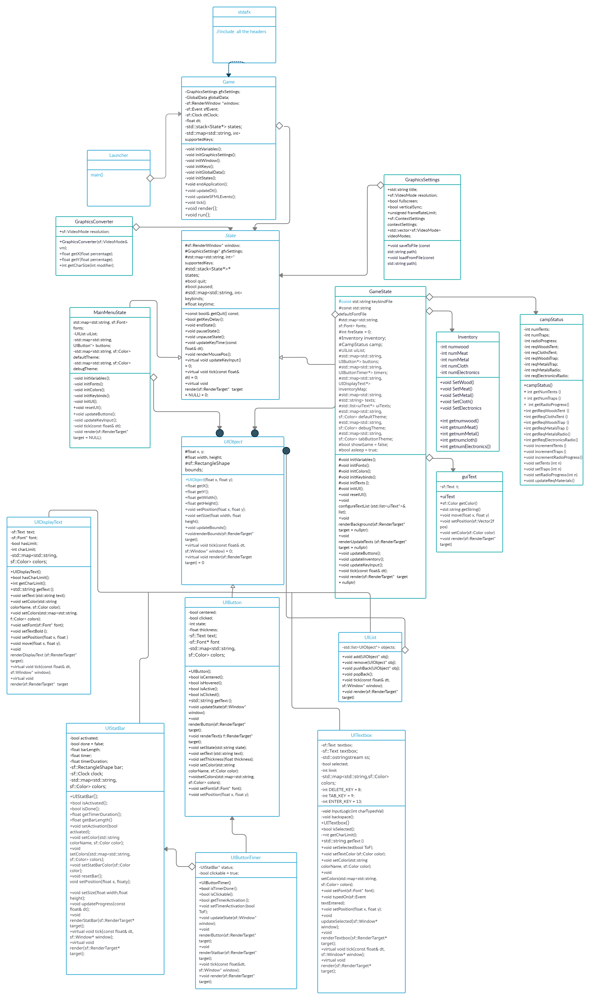

### Class Diagram Description:
The launcher contains the main function, in main() a Game object is instantiated. The Game class contains a stack of States and calls update and render functions of the current state the game is in. It also determines when to quits the game and when to continue running the game. The State class is where we implement the State design pattern. We declare an abstract State class with virtual functions: updateKeyInput, update, and render. Then we curently have two main states, MainMenuState and GameState, where those functions are implemented along with functions specific to each state. The GameState contains an Inventory which is a class that stores the amount of items the player has. Both the GameState and MainMenuState instantiate several UIObjects. The UIObject class is where we implemented the Composite Design Pattern. There is the abstract class UIObject, the compoite class UIList, and the leaf classes UIButton, UIDisplayText, UITextBox, UIButtonTimer, and UIStatBar. Each subclass of UIObject implements the render and tick virtual function, with each leaf class haveing their own unique functions they implement. 
 
 
 ## Screenshots
 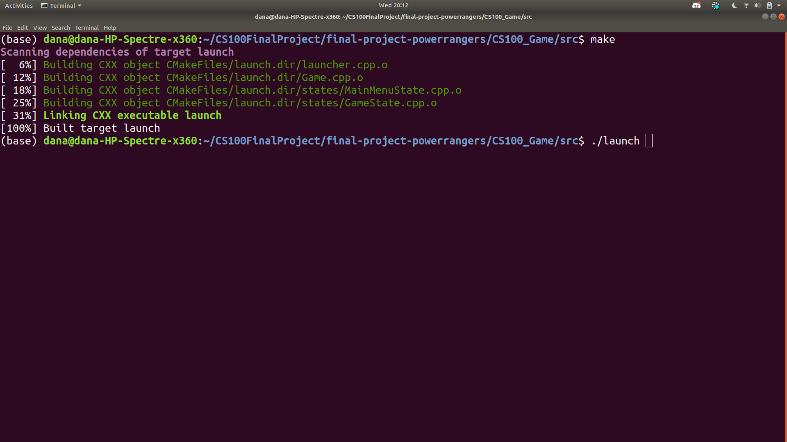
 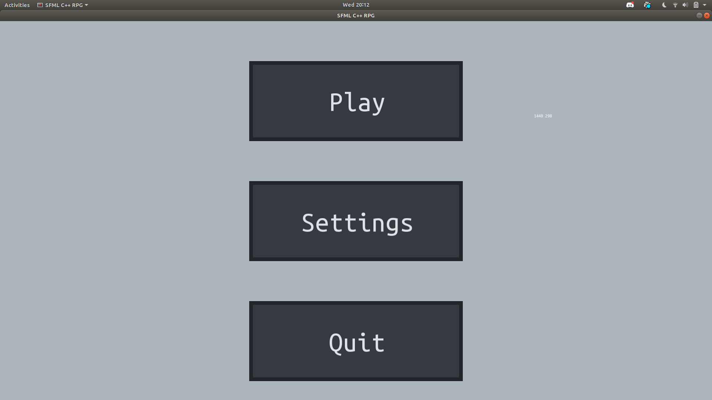
 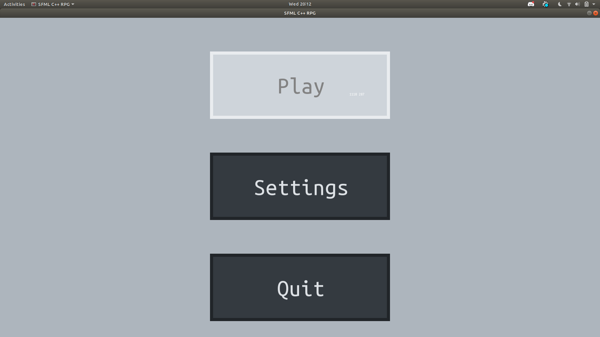
 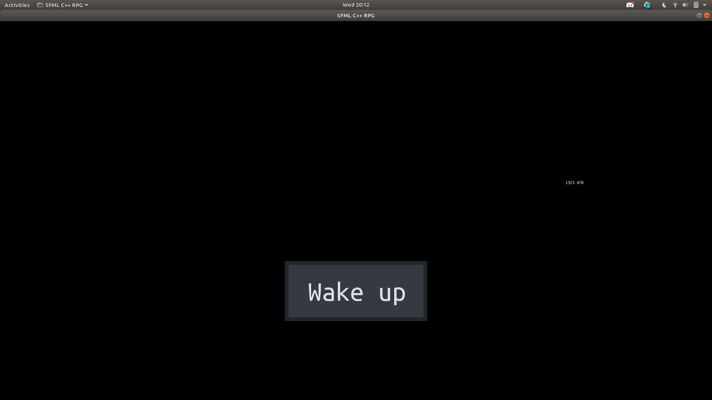
 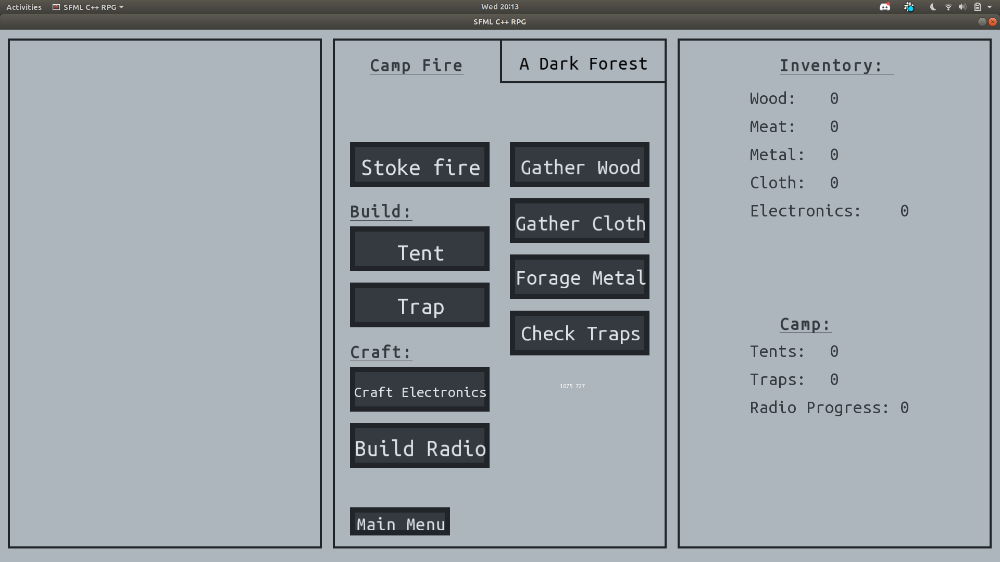
 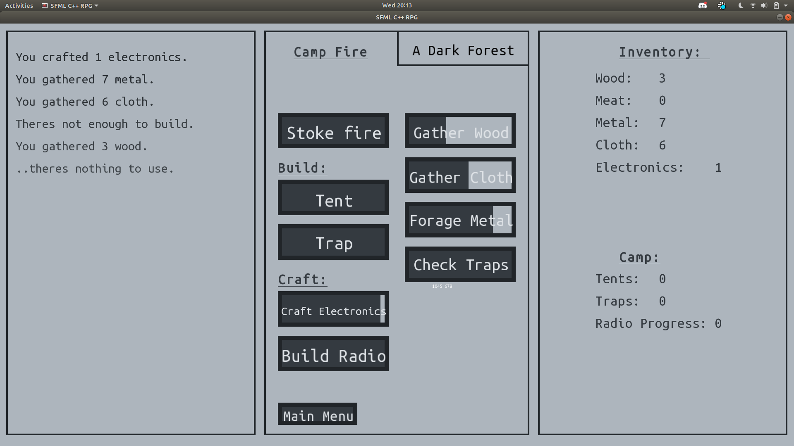
 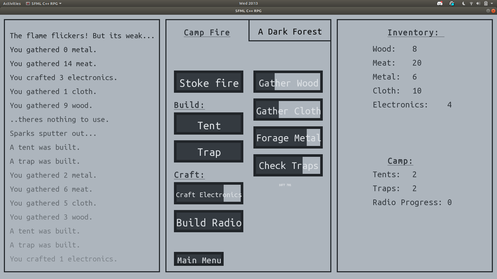
 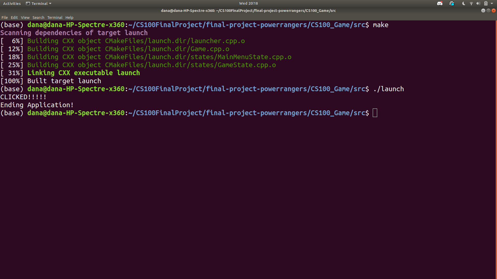
 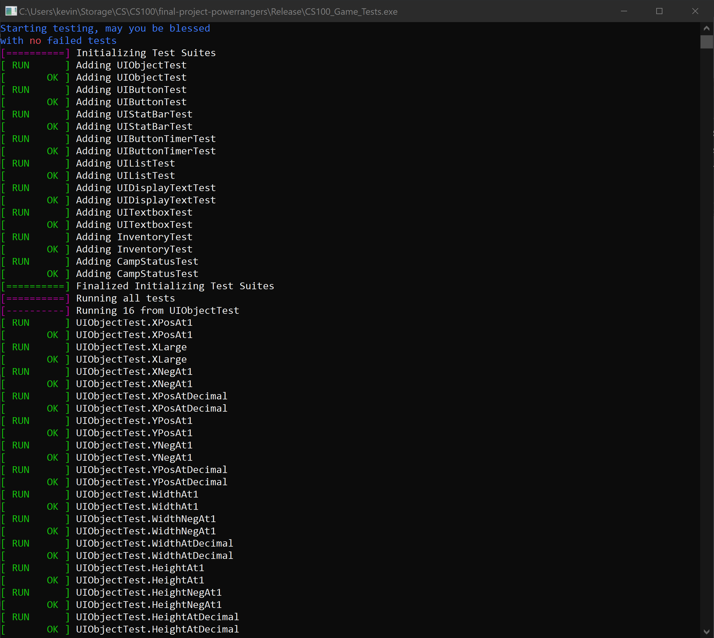
 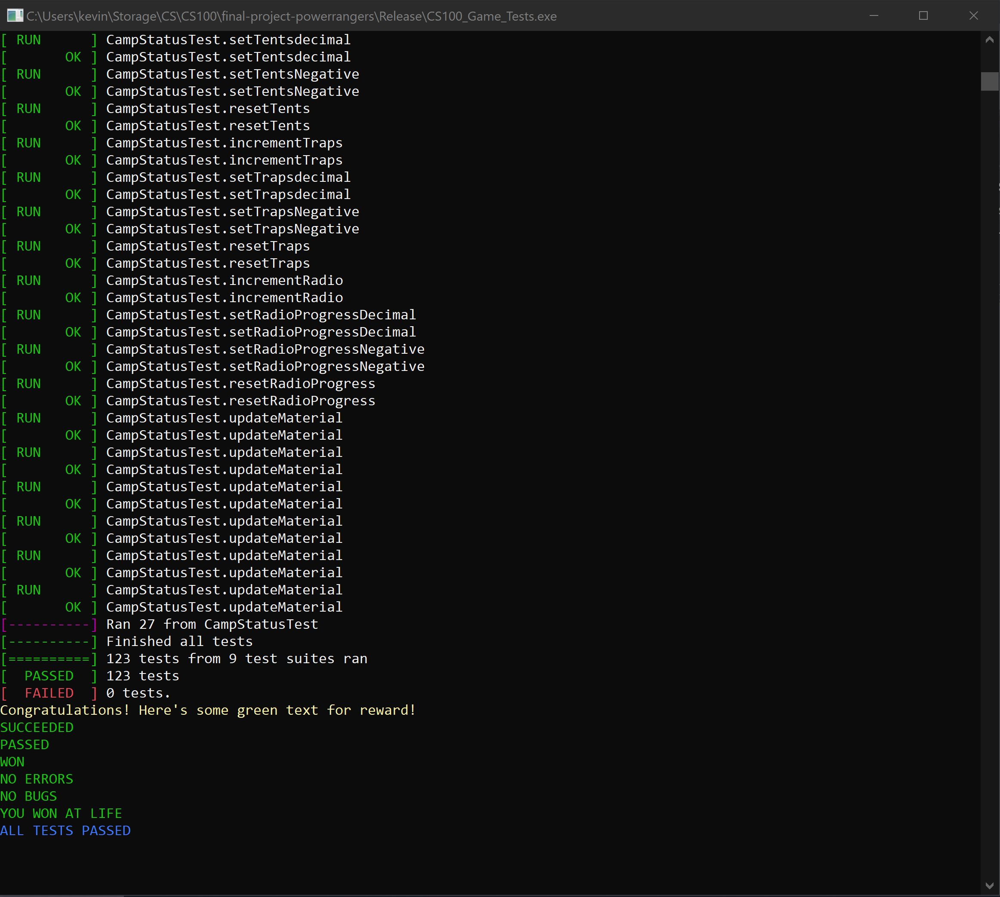
 
 ## Installation/Usage
 We have a release folder that has all of our resources and the executable. To run the game, someone should be able to download the release folder and run the executable.
 
## Testing
In order to test our project properly, we built our own testing framework. Our testing framework is very similar to google tests, and we put the testing code in a separate project folder named CS100_Game_Tests. Once our testing project is compiled, it will run an executable that will output the test suite's results. Currently, our testing framework supports expect_eq(), where we can compare integers, booleans, and strings to see if they are the correct expected value. While we may not be able to properly test the rendered UI of our project, we separated our functions to two case, tick() and render(). Tick() manages the data manipulation, the back-end, while render() simply draws to the screen the data supplied from tick(). This way, we can test and see if our data manipulation is correctly being ran, without having to output the UI. Some examples can be  seeing if UIObjects are being constructed properly with the correct values, if boundary collision is being detected properly, and if the correct states are being set for UIButtons. These data values all have acccessors and setters, where we can test to see if they're properly being manipulated.
